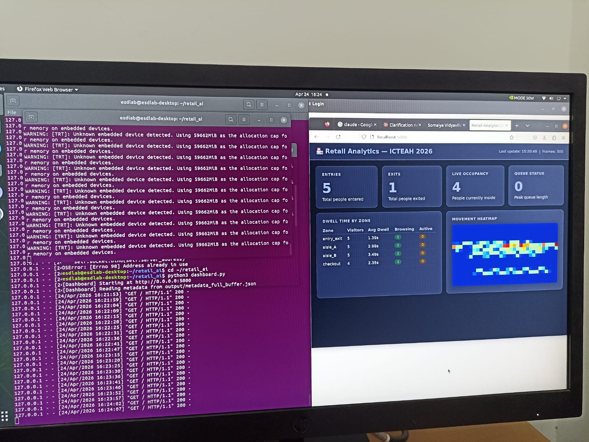

# Edge AI Retail Analytics

A retail video analytics system built with NVIDIA DeepStream, YOLO object detection, object tracking, and Python-based metadata analytics.

## Overview

The system processes recorded retail video through a DeepStream pipeline to detect and track objects, extract structured metadata, and derive higher-level analytics.

The analytics include:

- Entry and exit counting
- Dwell time estimation
- Movement heatmaps
- Queue detection
- Zone-based engagement analysis

## Demo

## Pipeline

Video Dataset → DeepStream / GStreamer → YOLO Detection → Object Tracking → Metadata Extraction → JSON → Retail Analytics

## Technologies

- NVIDIA DeepStream
- GStreamer
- YOLO
- NvMultiObjectTracker
- Python
- OpenCV
- JSON

## Model Setup

The pipeline uses YOLOv8n exported to ONNX format.

Place the model at:

    models/yolov8n.onnx

The model file is excluded from the repository through `.gitignore`.

## Project Structure

    edge-ai-retail-analytics/
    ├── config/
    │   ├── coco.names
    │   ├── pgie_yolov8.txt
    │   └── tracker.txt
    ├── analytics.py
    ├── deepstream_pipeline.py
    └── metadata_handler.py

## Metadata

The DeepStream pipeline extracts tracked-object metadata including:

- Object ID
- Bounding-box coordinates
- Detection confidence
- Object class
- Frame ID
- Timestamp

Frame metadata is stored as JSON, with accumulated metadata exported to:

    output/metadata_full_buffer.json

The metadata is then processed by `analytics.py` to calculate retail-level metrics.

## Analytics

`analytics.py` implements:

- Virtual tripwire-based entry and exit counting
- Zone-based dwell time estimation
- Object movement heatmaps
- Queue detection
- Zone engagement analysis

Dwell-time calculations currently use a 30 FPS assumption.

## Scope

The current implementation is focused on processing recorded retail video datasets. It demonstrates an edge-AI pipeline for object detection, tracking, metadata extraction, and downstream retail analytics.
